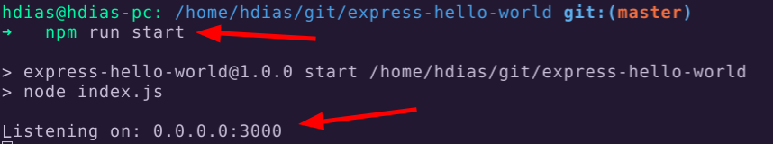
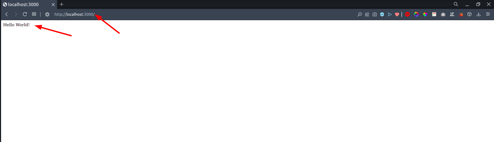

## Install dependencies.

```
$ npm install
```

## Run the app

```
$ npm run start
```

<hr />
Open your browser at:

**http://localhost:3000**



## Build Docker image

```
$ cd ~/express-hello-world  # or whatever is the directory location of this repo
$ docker build -t hello-world-image .
```


